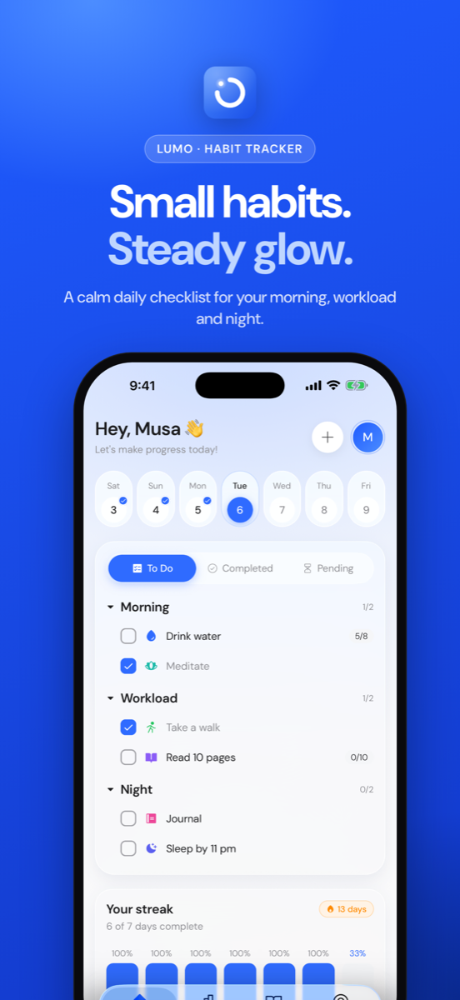
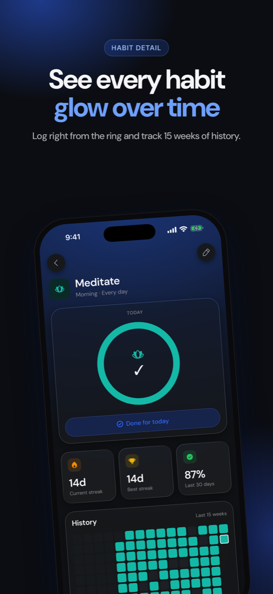
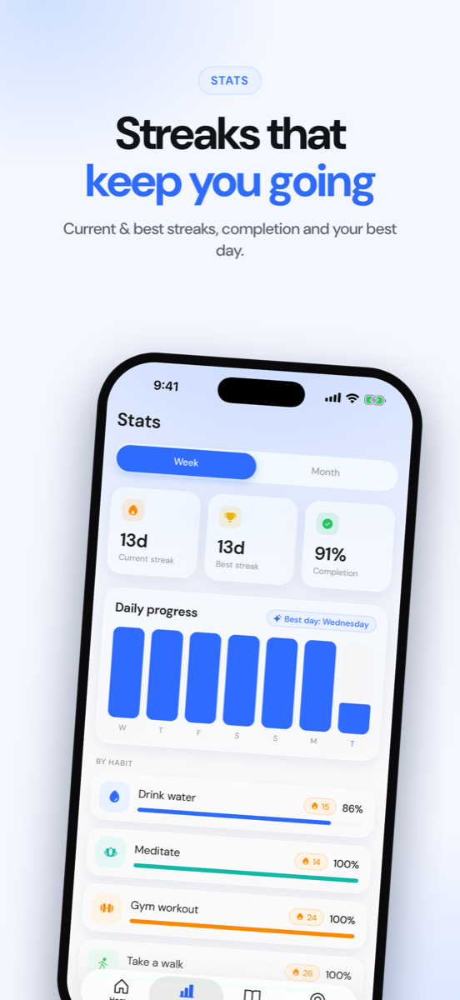
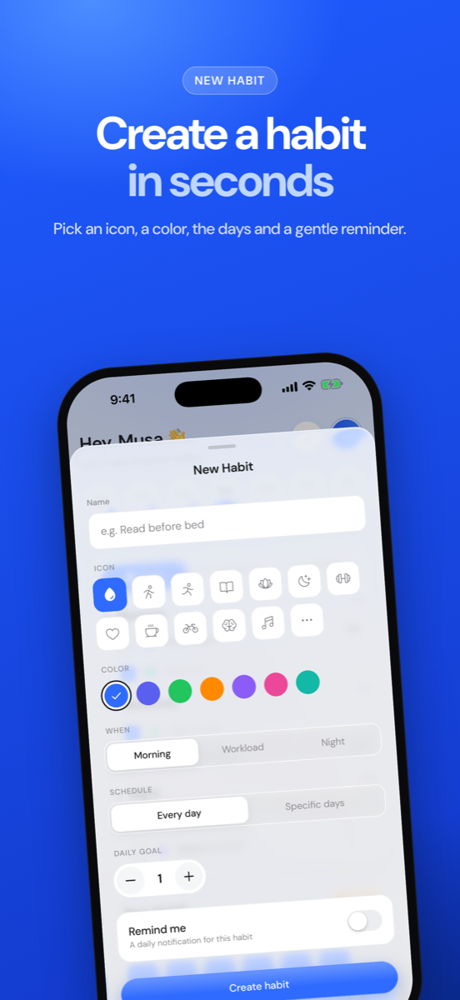
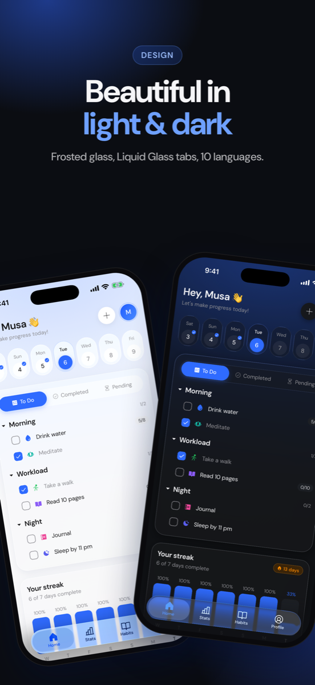
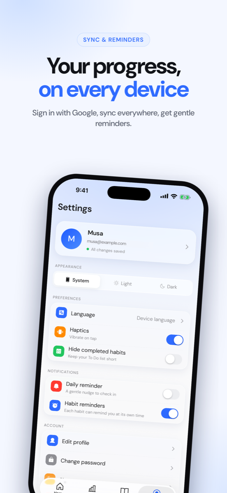

<div align="center">


# Lumo

**A minimal habit tracking app.** Small habits. Steady glow.

Plan your morning, workload and night in one calm checklist, keep your streak alive,
and see your progress on every device. Built with Expo, React Native and Supabase.

[**Website**](https://musajawad004.github.io/lumo/) · [Privacy](https://musajawad004.github.io/lumo/privacy.html) · [Terms](https://musajawad004.github.io/lumo/terms.html)


</div>

---

## Screenshots

<p align="center">
  
  
  
</p>
<p align="center">
  
  
  
</p>

Full-resolution App Store versions (1320 × 2868) live in [`docs/store/screenshots/`](docs/store/screenshots).

## Features

- **Morning · Workload · Night**: group habits by part of the day; tap to check off. Count habits ("8 glasses") step up as you go.
- **Schedules**: every day, or only the weekdays you pick (e.g. gym on Mon/Wed/Fri).
- **Fair streaks**: rest days never break a streak, and an unfinished *today* doesn't count against you.
- **Stats**: current and best streak, completion %, best weekday, week/month chart, per-habit breakdown.
- **Habit detail**: a progress ring to log right there, streaks, last-30-days rate and a 15-week heatmap.
- **Reminders**: a daily check-in plus a reminder per habit (silent, local notifications).
- **Accounts & sync**: email or Google sign-in, profile photo, local-first storage with an offline outbox that syncs to Supabase.
- **Settings follow you**: theme, language and reminder preferences are saved to your account.
- **10 languages**: English, Arabic, Spanish, French, Portuguese, German, Turkish, Hindi, Urdu, Indonesian, with right-to-left layouts.
- **Design**: DM Sans, blue `#2F6BFF`, frosted glass, Liquid Glass native tab bar on iOS 26, light & dark mode, a 3.5 s animated splash.
- **Backend-managed starter habits**: new accounts get a few habits from a Supabase table you can edit without an app update.

## Tech stack

| | |
|---|---|
| App | Expo SDK 57 · React Native 0.86 · React 19 · TypeScript (strict) |
| Navigation | Expo Router (file-based) with native tabs |
| State | Zustand, persisted with `expo-sqlite/kv-store` |
| Backend | Supabase: Postgres + Row Level Security, Auth (email, Google), Storage (avatars) |
| UI | Reanimated 4, react-native-svg, expo-blur / expo-glass-effect, Phosphor icons, DM Sans |
| Notifications | expo-notifications (local, daily/weekly triggers) |
| Tests | Jest (jest-expo): streaks, schedules, dates, sync queue, translations, validation, data mapping |

## Getting started

**Requirements:** Node 20+, Yarn 1, Xcode (iOS) and/or Android Studio, a Supabase project.

```bash
git clone https://github.com/musaJawad004/lumo.git
cd lumo
yarn install
cp .env.example .env        # add your Supabase URL + publishable key
```

**Set up Supabase** (once): run every file in `supabase/migrations/` in order in the SQL Editor, then add
`lumo://**` under *Authentication → URL Configuration → Redirect URLs*. Full guide: [`supabase/README.md`](supabase/README.md).
Google sign-in guide: [`docs/GOOGLE_SIGN_IN.txt`](docs/GOOGLE_SIGN_IN.txt).

**Run it** (development build):

```bash
npx expo run:ios            # or: npx expo run:android
npx expo start --dev-client # later runs, JS changes only
```

## Scripts

| Command | What it does |
|---|---|
| `yarn start` | Start the dev server |
| `yarn ios` / `yarn android` | Open on a simulator / emulator |
| `yarn test` | Run the unit tests |
| `yarn typecheck` | TypeScript check |
| `yarn lint` | ESLint |
| `npx expo-doctor` | Check SDK / dependency health |

## Project structure

```
src/
  app/            Expo Router routes: (tabs), (auth), habit/[id], profile, …
  components/     ui · glass · home · habit · stats · settings · auth · layout · motion
  services/       sync (outbox), habits, session, notifications, api/ (Supabase)
  store/          Zustand stores (habits, logs, settings, profile, outbox, auth, sync)
  i18n/           10 locales + t() with {{placeholders}}
  theme/          colors, typography, tokens, ThemeProvider
  utils/          dates, schedule, stats (pure + unit-tested)
  __tests__/      Jest tests
supabase/
  migrations/     schema, RLS, triggers, starter habits
docs/             product/architecture docs, landing page (GitHub Pages), screenshots
```

## How sync works

Every change updates the on-device store instantly and is added to a persisted **outbox**. The outbox
is sent to Supabase in order (and retried when the app returns to the foreground), so the app works
fully offline. On sign-in the app downloads your habits and the last 180 days of logs. Row Level
Security guarantees each account can only read and change its own rows.

## Releasing

Builds use **EAS** (`eas.json`):

```bash
npx eas-cli@latest login
npx eas-cli@latest init                       # links the project to your Expo account
npx eas-cli@latest build --profile preview    # internal test build (iOS + Android)
npx eas-cli@latest build --profile production
npx eas-cli@latest submit --profile production
```

See [`docs/06-ROADMAP.md`](docs/06-ROADMAP.md) for the launch checklist and
[`docs/store/listing.md`](docs/store/listing.md) for the store listing copy.

## Contributing

Issues and pull requests are welcome. Please run `yarn typecheck && yarn lint && yarn test` before opening a PR.

## License

[MIT](LICENSE)
